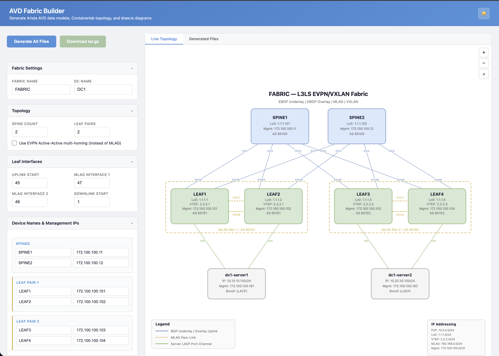
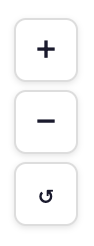
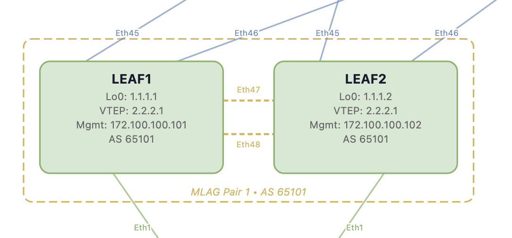
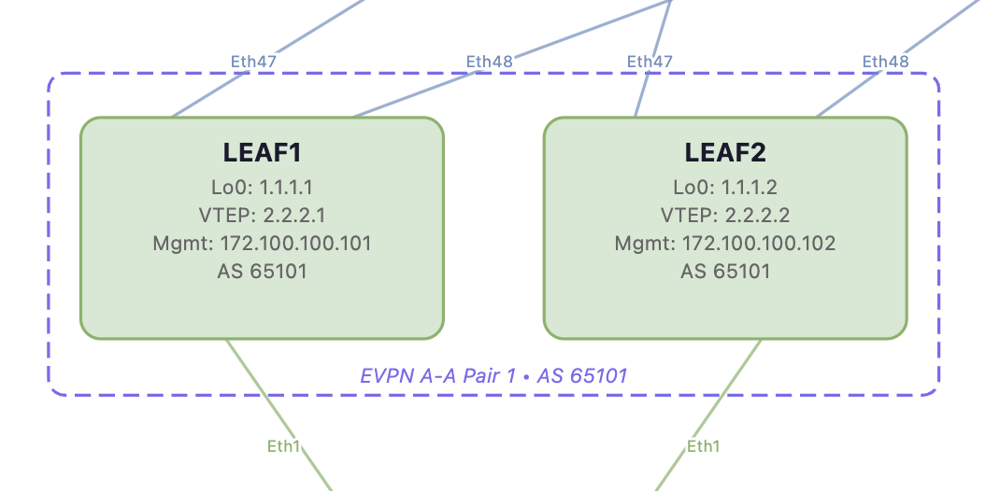
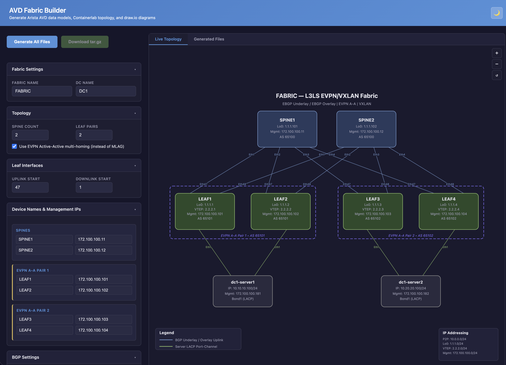
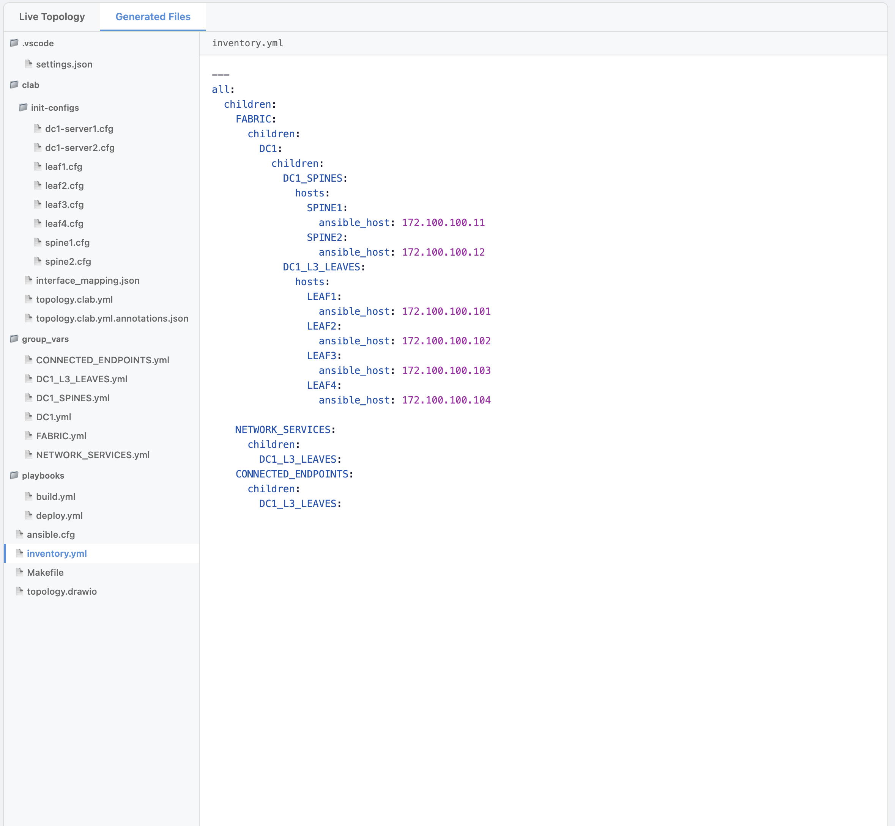

# AVD Fabric Builder

A browser-based tool for generating complete [Arista AVD](https://avd.arista.com/) (Arista Validated Designs) data center fabric configurations. No installation required — just open `app.html` in your browser.



## What It Generates

From a simple web form, AVD Fabric Builder produces a complete, ready-to-deploy set of files:

| Category | Files |
|----------|-------|
| **AVD Group Vars** | `FABRIC.yml`, `DC1.yml`, `DC1_SPINES.yml`, `DC1_L3_LEAVES.yml`, `NETWORK_SERVICES.yml`, `CONNECTED_ENDPOINTS.yml` |
| **Ansible** | `inventory.yml`, `ansible.cfg`, `Makefile`, `playbooks/build.yml`, `playbooks/deploy.yml` |
| **Containerlab** | `topology.clab.yml`, `interface_mapping.json`, `topology.clab.yml.annotations.json`, init-configs for every device |
| **Diagrams** | `topology.drawio` (importable into draw.io) |

## Quick Start

1. Open `app.html` in any modern web browser (Chrome, Firefox, Safari, Edge)
2. Configure your fabric using the form on the left
3. View the live topology diagram updating in real-time on the right
4. Click **Generate All Files** to produce all configuration files
5. Click **Download tar.gz** to save everything as an archive


## Features

### Live Topology Preview

The right panel shows a real-time topology diagram that updates instantly as you change any setting. The diagram is fully interactive:

- **Scroll wheel** to zoom in/out
- **Click and drag** to pan
- **Double-click** to reset the view
- **+/- buttons** in the top-right corner for precise zoom control



### MLAG vs. EVPN Active-Active Multi-Homing

Toggle between two dual-homing strategies using the checkbox in the Topology section:

- **MLAG (default)** — Traditional MLAG pairs with peer-link interfaces between leaf switches. Leaves share a VTEP IP.
- **EVPN Active-Active** — EVPN Ethernet Segment-based multi-homing with no peer-links. Each leaf gets a unique VTEP IP.

| MLAG Mode | EVPN A-A Mode |
|-----------|---------------|
|  |  |

When EVPN A-A is selected:
- MLAG interface and pool fields are automatically hidden
- The AVD data model includes `mlag: false` and `short_esi: auto` on connected endpoints
- Containerlab topology omits MLAG peer-links
- Diagrams update to show "EVPN A-A Pair" labels with no peer-link lines

### Light / Dark Mode

Click the sun/moon icon in the top-right of the header to toggle between light and dark themes. Your preference is saved across sessions.

| Light Mode | Dark Mode |
|------------|-----------|
|  |  |

### Generated Files Browser

After clicking **Generate All Files**, switch to the **Generated Files** tab to browse and inspect every file:

- Syntax-highlighted YAML, JSON, and EOS config preview
- File sidebar auto-sizes to fit the longest filename
- Resizable sidebar for custom width
- Copy to clipboard for any file



## Configuration Options

### Fabric Settings

| Field | Description | Default |
|-------|-------------|---------|
| Fabric Name | Top-level AVD fabric name | `FABRIC` |
| DC Name | Data center name (used for inventory groups) | `DC1` |

### Topology

| Field | Description | Default |
|-------|-------------|---------|
| Spine Count | Number of spine switches (1-8) | `2` |
| Leaf Pairs | Number of leaf switch pairs (1-16) | `2` |
| EVPN A-A | Use EVPN Active-Active instead of MLAG | Unchecked |

### Leaf Interfaces

| Field | Description | Default |
|-------|-------------|---------|
| Uplink Start | First Ethernet interface for spine uplinks | `45` (MLAG) / `47` (A-A) |
| MLAG Interface 1 | First MLAG peer-link interface (MLAG only) | `47` |
| MLAG Interface 2 | Second MLAG peer-link interface (MLAG only) | `48` |
| Downlink Start | First Ethernet interface for server-facing ports | `1` |

### Device Names & Management IPs

Customize the hostname and management IP for every spine and leaf switch. Defaults are auto-generated based on spine/leaf count.

### BGP Settings

| Field | Description | Default |
|-------|-------------|---------|
| Spine BGP AS | BGP AS number for all spines | `65100` |
| Leaf Starting AS | First leaf pair AS (increments per pair) | `65101` |

### IP Addressing Pools

| Field | Description | Default |
|-------|-------------|---------|
| P2P Links | Spine-leaf point-to-point subnet | `10.0.0.0/24` |
| Loopback0 Pool | Router-ID loopback addresses | `1.1.1.0/24` |
| VTEP Loopback Pool | VXLAN VTEP loopback addresses | `2.2.2.0/24` |
| MLAG Peer Pool | MLAG peer-link IP pool (MLAG only) | `192.168.0.0/24` |
| MLAG L3 Peer Pool | MLAG L3 peering IP pool (MLAG only) | `192.168.1.0/24` |
| Mgmt Subnet | Management network subnet | `172.100.100.0/24` |
| Mgmt Gateway | Management network gateway | `172.100.100.1` |

### Platform & Protocols

| Field | Description | Default |
|-------|-------------|---------|
| Platform | EOS platform type | `cEOSLab` |
| Underlay Protocol | Underlay routing protocol | `eBGP` |
| Overlay Protocol | Overlay routing protocol | `eBGP` |
| Virtual Router MAC | Anycast gateway MAC address | `00:1c:73:00:00:99` |

## Using the Generated Files

### With Containerlab

```bash
# Extract the archive
tar xzf fabric.tar.gz
cd fabric/clab

# Deploy the lab
sudo clab deploy -t topology.clab.yml

# View the topology graph (uses annotations.json for layout)
sudo clab graph -t topology.clab.yml
```

### With Ansible AVD

```bash
# Extract the archive
tar xzf fabric.tar.gz
cd fabric

# Install AVD collection
ansible-galaxy collection install arista.avd

# Build configurations
make build

# Deploy to devices
make deploy
```

### Import Diagram into draw.io

1. Open [draw.io](https://app.diagrams.net/) or the draw.io desktop app
2. File > Open > select `topology.drawio`
3. The full topology diagram with all node details, links, legend, and IP summary is ready to edit

## Requirements

- Any modern web browser (no server, no dependencies, no installation)
- [Containerlab](https://containerlab.dev/) for lab deployment (optional)
- [Arista AVD](https://avd.arista.com/) Ansible collection for config generation and deployment (optional)
